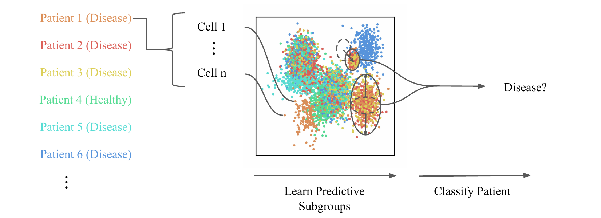

CloudPred
=========

This repository contains code for reproducing the experiments from "CloudPred: Predicting Individual Outcome From Heterogeneous Point Clouds".



Installation
------------

First, clone this repository and enter the directory by running:

    git clone https://github.com/echonet/dynamic.git
    cd dynamic

CloudPred is implemented for Python 3 and can be installed by navigating to the cloned directory and running

    pip install --user .

Contents
--------

- [`cloudpred`](cloudpred) contains implementations of CloudPred and other methods in the manuscript
- [`scripts`](scripts) contains code to preprocess the data, run the methods, and plot results


Experiments
-----------

### Simulations
The experimental results from Figure 3 can be generated by running:
```
scripts/run_all.sh
```

This scripts calls `scripts/run_simulation.sh`, which generates the results for Figure 1a and 1b, and `scripts/run_interaction.sh`, which generates the results for Figure 1c.
These in turn call `scripts/synthetic.py`, which generates the simulated datasets.

### Lupus

The data for the lupus experiments should first be obtained form the original studies.
Then, to preprocess, in this directory, run:
```
scripts/process_lupus.py
```

The results for the lupus experiments are generated by running:
```
scripts/run_lupus.sh
```

Generating Figures and Results
------------------------------
Using the results from the previous scripts, the performance plots in the manuscript can be generated by running:
```
scripts/plot.py
```
and the clustering results can be generated by running:
```
scripts/visualize.py
```
